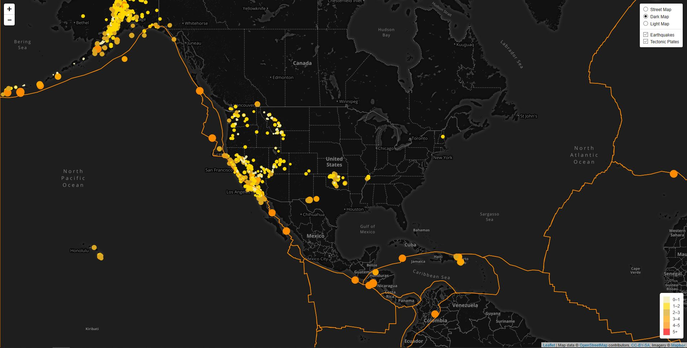
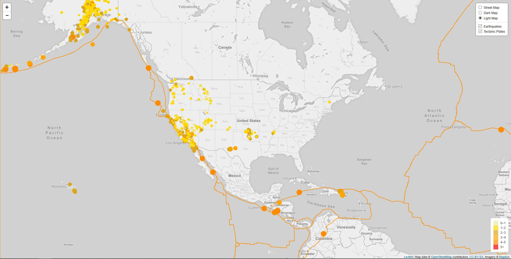
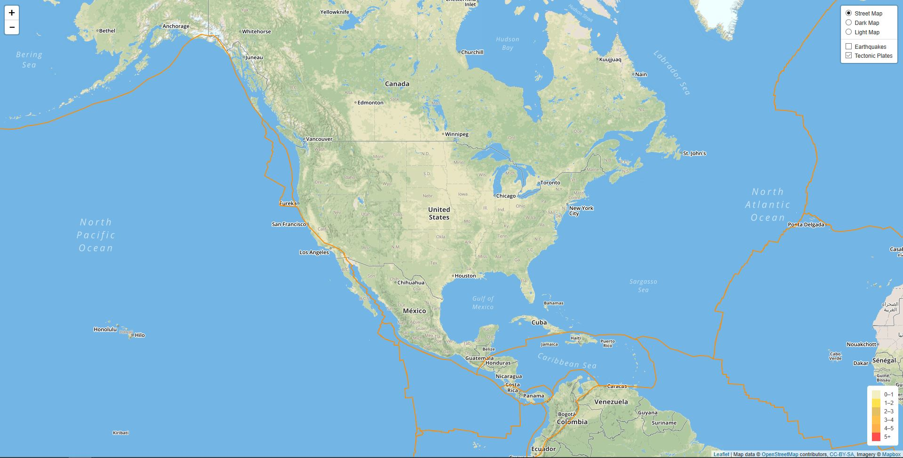
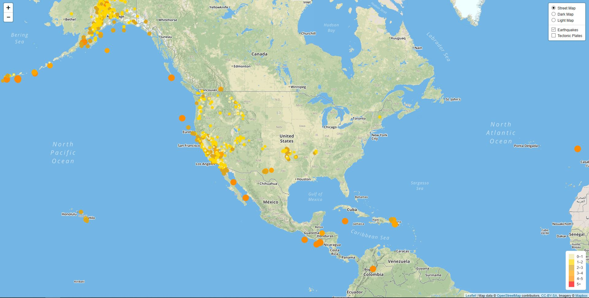

# Earthquake Data Visualization

## **Objective:**
The objective of this project is to use Leaflet to map the earthquakes that occurred during the last 7 days using data from the United States Geological Survey (USGS) API, as well as the shape of the tectonic plates. The size and colour of the earthquake data markers reflect the magnitude of each earthquake. The colours used are shown in the legend. The earthquake’s magnitude and location are presented in a popup when a marker is clicked. Additionally, the interactive map allows users to choose between several base maps (street, dark, and light) and whether to display the earthquakes and tectonic plates. 

## **Tools:**
1. JavaScript - Leaflet, D3
2. HTML/CSS

## **Data Sources:**
* United States Geological Survey (USGS) API
* Tectonic Plates GeoJSON: https://github.com/fraxen/tectonicplates

## **Screenshots:**
Street Map

Dark Map

Light Map

Without Earthquakes

Without Tectonic Plates

